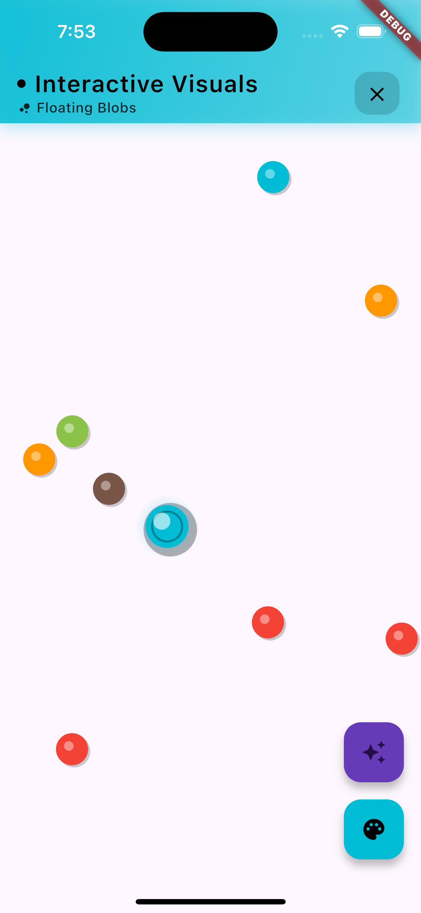
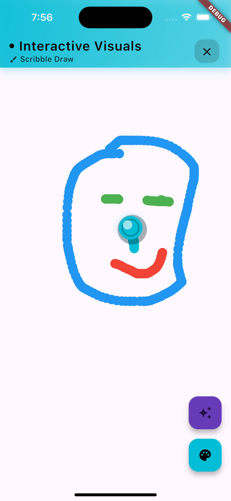
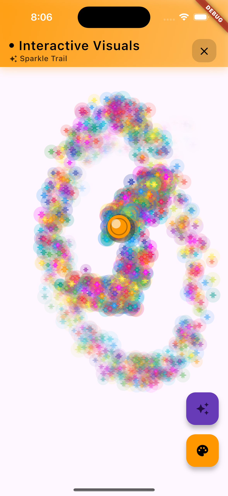

# 🎨 Interactive Visuals Flutter App

A beautiful, interactive Flutter application featuring **7 stunning visual effects** with dynamic theming and professional UI design. Created to showcase advanced Flutter animations, custom painting, and interactive touch experiences.

<div align="center">

[](assets/demo.mov)
[](#-screenshots--demo)
[](https://flutter.dev)
[](LICENSE)

</div>

## ✨ Features

### 🎯 **7 Interactive Visual Effects**

| Effect | Description | Icon |
|--------|-------------|------|
| **Particle Trail** | Colorful particles that follow your finger movement with realistic physics | 🔴 |
| **Ripple Effect** | Touch creates expanding water-like ripples with inner wave details | 💧 |
| **Spring Object** | A ball that follows your finger with spring physics and damping | 🏀 |
| **Scribble Draw** | Freehand drawing with smooth paint strokes and customizable colors | 🖌️ |
| **Sparkle Trail** | Rainbow glitter sparkles with 6-pointed stars and glow effects | ✨ |
| **Bezier Web** | Curved bezier lines connecting finger paths with smooth animations | 📈 |
| **Floating Blobs** | Autonomous bouncing blobs that react to touch interactions | 🫧 |

### 🎨 **Dynamic UI & Design**

- **Professional App Bar**: Dynamically changes color based on selected paint color
- **Smart Color Detection**: Automatically adjusts text/icon colors for optimal contrast
- **Gradient Backgrounds**: Beautiful 3-layer gradients with professional shadows
- **Smooth Animations**: 300ms transitions throughout the app
- **Modern Typography**: Premium font weights and letter spacing
- **Interactive Effect Selector**: Grid-based effect switcher with overlay UI

### 🔧 **Technical Features**

- **Real-time Rendering**: 60 FPS smooth animations using Flutter's CustomPainter
- **Optimized Performance**: Effect-specific rendering and state management
- **Professional Architecture**: Clean code separation with controllers, models, and widgets
- **Responsive Design**: Works perfectly on all screen sizes
- **Material 3 Compliance**: Modern design following latest Material Design guidelines
- **Complete Documentation**: Includes screenshots, demo video, and comprehensive guides

## 🚀 Getting Started

### Prerequisites

- Flutter SDK (>=3.0.0)
- Dart SDK (>=2.17.0)
- Android Studio / VS Code
- iOS/Android device or emulator

### Installation

1. **Clone the repository**
```bash
git clone https://github.com/Piyushhhhh/flutter-visuals.git
cd flutter-visuals
```

2. **Install dependencies**
```bash
flutter pub get
```

3. **Run the app**
```bash
flutter run
```

## 🎮 How to Use

### Basic Controls

1. **Launch the app** - You'll see the default Particle Trail effect
2. **Touch and drag** on the screen to interact with the current effect
3. **Tap the magic wand button** (⭐) to open the effect selector
4. **Select any effect** from the grid to switch instantly
5. **Use the color picker** (🎨) to change effect colors
6. **Clear the screen** (🧹) to reset all effects

### Effect-Specific Interactions

- **Particle Trail**: Drag to create colorful particle streams
- **Ripple Effect**: Touch to create expanding ripples
- **Spring Object**: The ball follows your finger with realistic physics  
- **Scribble Draw**: Draw freely with customizable brush colors
- **Sparkle Trail**: Drag to create rainbow sparkle trails
- **Bezier Web**: Draw to create smooth curved line connections
- **Floating Blobs**: Touch to interact with autonomous bouncing balls

## 🏗️ Architecture

### Project Structure

```
lib/
├── main.dart                          # App entry point and main UI
├── controllers/
│   └── visual_effects_controller.dart # State management and effect logic
├── models/
│   └── visual_effects_models.dart     # Data models for all effects
├── widgets/
│   ├── interactive_canvas.dart        # Main canvas widget
│   └── effect_selector.dart          # Effect selection UI
├── painters/
│   └── visual_effects_painter.dart    # Custom painters for rendering
└── core/
    ├── constants/
    │   └── app_constants.dart         # App-wide constants
    └── extensions/
        └── offset_extensions.dart     # Utility extensions
```

### Key Components

- **VisualEffectsController**: Manages state and coordinates all effects
- **VisualEffectsPainter**: Handles rendering with effect-specific painters
- **EffectSelector**: Professional UI for switching between effects
- **InteractiveCanvas**: Touch-responsive canvas with gesture handling

## 🎨 Customization

### Adding New Effects

1. **Add to EffectType enum** in `visual_effects_models.dart`
2. **Create model class** extending `VisualEffect`
3. **Add update logic** in `VisualEffectsController`
4. **Implement painter** in `VisualEffectsPainter`
5. **Add icon mapping** in `_getEffectIcon` method

### Styling

- **Colors**: Modify `_availableColors` and `_rainbowColors` arrays
- **Physics**: Adjust constants in `app_constants.dart`
- **Animations**: Update duration values in controller methods
- **UI**: Customize `_DynamicAppBar` and `EffectSelector` widgets

## 🔧 Technical Details

### Performance Optimizations

- **Selective Rendering**: Only renders the current effect type
- **Efficient State Management**: Uses `ChangeNotifier` for optimal rebuilds
- **Memory Management**: Automatic cleanup of expired effects
- **Smooth Animations**: 60 FPS with `AnimationController`

### Key Dependencies

- **Flutter SDK**: Core framework
- **Material Icons**: Professional iconography
- **Custom Painting**: For high-performance rendering

## 🤝 Contributing

Contributions are welcome! Here's how to get started:

1. **Fork the repository**
2. **Create a feature branch** (`git checkout -b feature/amazing-effect`)
3. **Commit your changes** (`git commit -m 'Add amazing effect'`)
4. **Push to the branch** (`git push origin feature/amazing-effect`)
5. **Open a Pull Request**

### Contribution Guidelines

- Follow Flutter best practices
- Add tests for new effects
- Update documentation
- Maintain consistent code style
- Test on multiple devices

## 📱 Screenshots & Demo

### 🎥 **Live Demo Video**
[](assets/demo.mov)

*Full working demonstration of all 7 interactive visual effects*

> **Note**: To view the demo video, download the [demo.mov](assets/demo.mov) file from the assets folder, as GitHub doesn't support direct .mov playback in markdown.

### 📸 **App Screenshots**

<div align="center">

| Floating Blobs Effect | Particle Trail Effect | Sparkle Trail Effect |
|:---------------------:|:--------------------:|:-------------------:|
|  |  |  |

</div>

### ✨ **Key Visual Features Shown**
- **Dynamic app bar** with gradient background matching paint color
- **Professional cross icon** for clearing the frame
- **Floating action buttons** with effect selector and color picker
- **Real-time visual effects** responding to touch interactions
- **Smooth animations** and particle physics
- **Modern UI design** with clean typography and spacing

## 🐛 Known Issues

- None currently reported

## 📋 TODO

- [ ] Add sound effects for interactions
- [ ] Implement effect recording/playback
- [ ] Add more color palettes
- [ ] Create effect presets
- [ ] Add haptic feedback

## 📄 License

This project is licensed under the MIT License - see the [LICENSE](LICENSE) file for details.

## 🙏 Acknowledgments

- Flutter team for the amazing framework
- Material Design team for design guidelines
- Community contributors and testers

## 📞 Contact

- **GitHub**: [@Piyushhhhh](https://github.com/Piyushhhhh)
- **Project Link**: [https://github.com/Piyushhhhh/flutter-visuals](https://github.com/Piyushhhhh/flutter-visuals)

---

⭐ **Star this repository** if you found it helpful!

Made with ❤️ and Flutter
